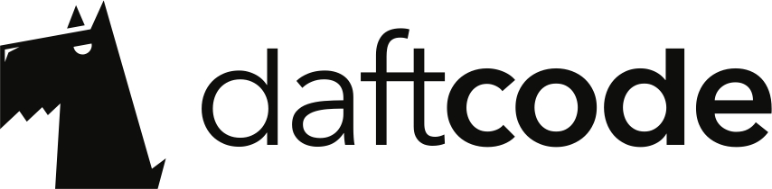

# Machine Learning Level Up

To jest repo z materiałami do zajęć.

Każda grupa będzie pracować na jednej zewnętrznej maszynie. Będziemy pracować na 
**jupyter**, na którym będzie interaktywny python, którego będzie można odpalać
z przeglądarki. Wymagać to będzie konfiguracji maszyny. Wystarczy, że jedna 
osoba w grupie skonfiguruje maszynę tak, że reszta będzie mogła pracować z 
przeglądarki.

## Hasło do WiFi

Nazwa: `MINIkonferencja`
Hasło: `WARSZTATYDAFT`

## Logowanie sie na maszyny

### Linux

W konsoli wpisujemy:

```
ssh ml@<adres-ip>
```
Gdzie `adres-ip`, to indywidualny adres maszyny dostępny każdej z grup.

Hasło to: `daft_ml2017pw`. 


### Windows

To jest nierekomentowany sposób konfiguracji maszyny.

Na początek trzeba sprawdzić czy jest zainstalowane [putty](http://www.putty.org/).
Następnie w odpowiednim miejscu wpisać użytkowanika (`ml`), ip (podane każdej grupie) i 
hasło (`daft_ml2017pw`).

## Ściąganie materiałów

W konsoli wpisujecie:
```
git clone https://github.com/daftcode/zajecia_machine_learning_mini
```

Zwróćcie uwagę na pliki `*.ipynb` - są to pliki z _notebookami_ z materiałami - 
są tam wykłady i ćwiczenia.

## Odpalanie jupytera

```
jupyter notebook
```

Powinna Wam się wtedy automatycznie odpalić karta w przeglądarce z interpreterem
pythona. Z przeglądarki możecie skopiować link i podzielić się z resztą grupy.

